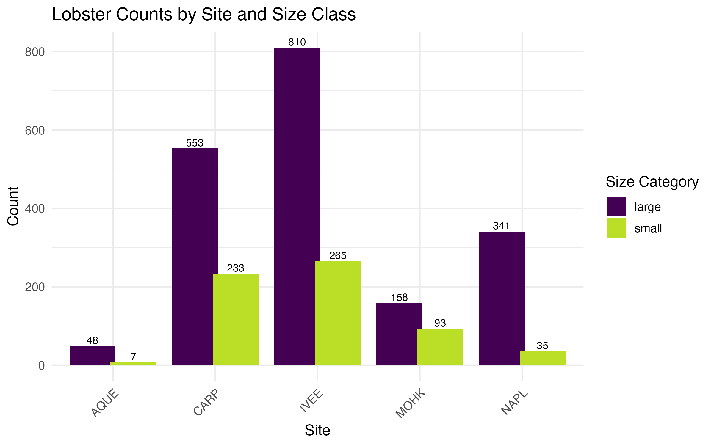
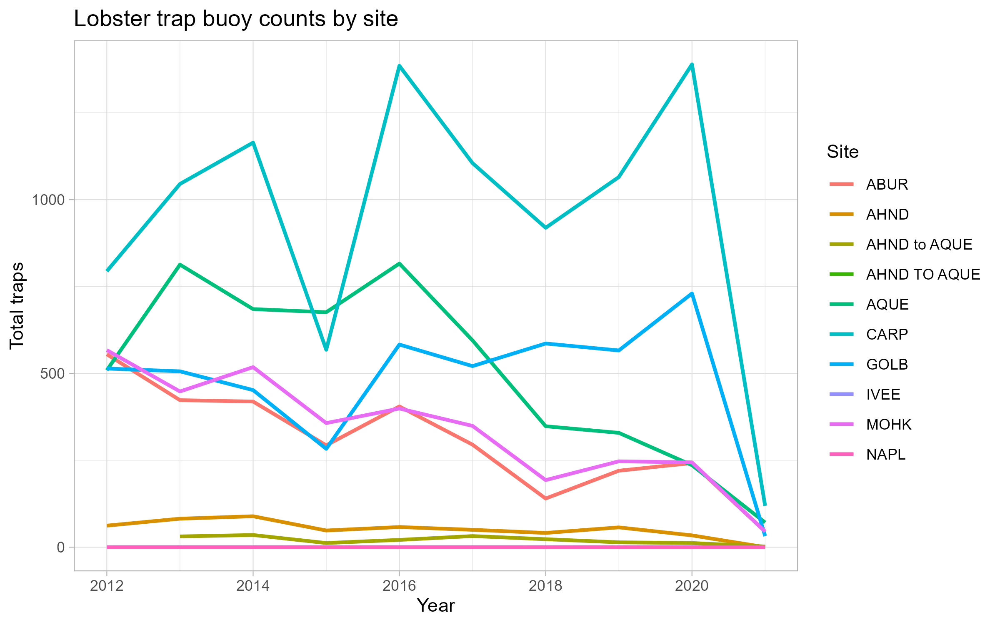

# Introduction:

The data for this report was pulled from the Santa Barbra Coastal LTER group and focuses on the abundance, size, and fishing pressure of California spiny lobster. The monitoring of these three data points is indicative of the health of the kelp forests off the coast of southern California. The data points are collected from Marine Protected Ares (MPAs), which provides the opportunity to study natural community dynamics without outside interventions. The data was downloaded on April 20th, 2026 from the EDI Website (https://portal.edirepository.org/nis/mapbrowse?packageid=knb-lter-sbc.77.8). 

## Owner analysis: Lobster abundance

Total lobsters observed each year at each site.

## Collaborator analysis: Trap buoy counts

Total trap buoys observed each year at each site. Trap counts are a measure of fishing pressure.

## Summary

Looking at both plots together shows how fishing pressure compares across sites. IVEE and NAPL are marine protected areas, so trap counts at those sites should be near zero, while the fished sites (AQUE, CARP, MOHK) show how trap effort changes over time. Comparing these patterns to the abundance plot gives a sense of whether the protected sites support more lobsters than the fished ones.

